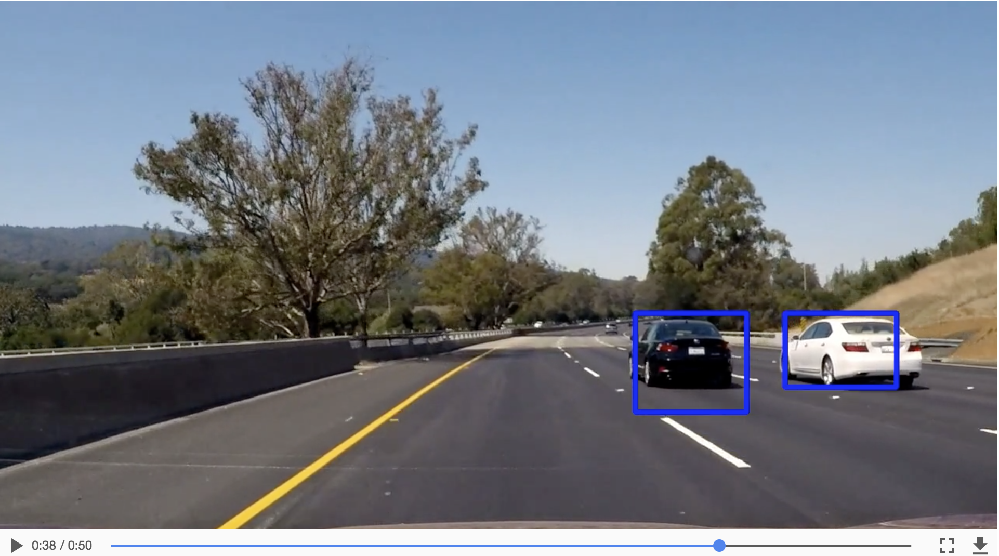

# Udacity Self-Driving Car Engineer Nanodegree Program
## *Vehicle Detection Project*

---

The goals / steps of this project are the following:

* Perform a Histogram of Oriented Gradients (HOG) feature extraction on a labeled training set of images and train a classifier Linear SVM classifier
* Optionally, you can also apply a color transform and append binned color features, as well as histograms of color, to your HOG feature vector.
* Note: for those first two steps don't forget to normalize your features and randomize a selection for training and testing.
* Implement a sliding-window technique and use your trained classifier to search for vehicles in images.
* Run your pipeline on a video stream (start with the test_video.mp4 and later implement on full project_video.mp4) and create a heat map of recurring detections frame by frame to reject outliers and follow detected vehicles.
* Estimate a bounding box for vehicles detected.

[//]: # (Image References)
[image1]: ./output_images/data_visualization.png
[image2]: ./output_images/HOG_Car_and_NonCar1.png
[image3]: ./output_images/HOG_Car_and_NonCar2.png
[image4]: ./output_images/bounding_box_78.png
[image5]: ./output_images/bounding_box_50.png
[image6]: ./output_images/bounding_box_38.png
[image7]: ./output_images/bounding_box_24.png
[image8]: ./output_images/bounding_box_combined_window.png
[image9]: ./output_images/heat_map.png
[image9a]: ./output_images/heat_map_threshold.png
[image10]: ./output_images/heat_map_sci_py.png
[image10a]: ./output_images/final_detect.png
[image11]: ./output_images/TestImagePipeline.png
[image12]: ./output_images/test_video_out_pipeline.png
[image13]: ./output_images/project_video_out_pipeline.png
[image14]: ./output_images/bounding_box.png
[video1]: ./test_video_out.mp4
[video2]: ./test_video_out_2.mp4
[video3]: ./project_video_out.mp4

## [Rubric](https://review.udacity.com/#!/rubrics/513/view) Points
### Here I will consider the rubric points individually and describe how I addressed each point in my implementation.

---
### Writeup / README

#### 1. Provide a Writeup / README that includes all the rubric points and how you addressed each one.

In this project, computer vision methods are used. It is not the only technique — deep learning could be used instead. The advantage of CV is that we can analyze, extract features in each step. Deep learning, in contrast, is more like a black box. The code is contained in the file __Vehicle_Detection.ipynb__

### Histogram of Oriented Gradients (HOG)

#### 1. Explain how (and identify where in your code) you extracted HOG features from the training images.

Algorithm needs to learn to detect a car in picture. The best way is to train the algorithm with lot of images, labeled "cars" and "non cars". I started by reading in all the `vehicle` and `non-vehicle` images.  There are 8792 car images and 8968 non car Images which are 64*64 pixels.
Here is an random example of the `vehicle` and `non-vehicle` classes.

![alt text][image1]

HOG stands for “Histogram of Oriented Gradients”. Basically, it divides an image in several pieces. For each piece, it calculates the gradient of variation in a given number of orientations. I  explored different color spaces and different `skimage.hog()` parameters (`orientations`, `pixels_per_cell`, and `cells_per_block`).  I grabbed random images from each of the two classes and displayed them to get a feel for what the `skimage.hog()` output looks like.

The less the number of pixels per cells (and other parameters), more general the data. The high the number of pixels per cells (and other parameters) more specific. By playing with the parameters, I found that orientations above 7, and 8 pixels per cell are enough to identify a car.

Here is an example using the `YCrCb` color space and HOG parameters of `orientations=8`, `pixels_per_cell=(8, 8)` and `cells_per_block=(2, 2)`:

The code for extracting HOG features from an image is defined by the method `get_hog_features`.  The figure below shows a comparison of a car image and its associated histogram of oriented gradients, as well as the same for a non-car image.

![alt text][image2]

The method `extract_features` in the section titled "__Method to Extract HOG Features from an Array of Car and Non-Car Images__" accepts a list of image paths and HOG parameters (as well as one of a variety of destination color spaces, to which the input image is converted), and produces a flattened array of HOG features for each image in the list.

Next, in the section titled "__Extract Features for Input Datasets and Combine, Define Labels Vector, Shuffle and Split__" I define parameters for HOG feature extraction and extract features for the entire dataset. These feature sets are combined and a label vector is defined (`1` for cars, `0` for non-cars). The features and labels are then shuffled and split into training and test sets in preparation to be fed to a linear support vector machine (SVM) classifier. The table below documents the twenty-five different parameter combinations that I explored.

| Configuration Label | Colorspace | Orientations | Pixels Per Cell | Cells Per Block | HOG Channel | Extract Time |
| :-----------------: | :--------: | :----------: | :-------------: | :-------------: | :---------: | ------------:|
| 1                   | RGB        | 9            | 8               | 2               | ALL         | 71.16        |
| 2                   | HSV        | 9            | 8               | 2               | 1           | 43.74        |
| 3                   | HSV        | 9            | 8               | 2               | 2           | 36.35        |
| 4                   | LUV        | 9            | 8               | 2               | 0           | 37.42        |
| 5                   | LUV        | 9            | 8               | 2               | 1           | 38.34        |
| 6                   | HLS        | 9            | 8               | 2               | 0           | 37.42        |
| 7                   | HLS        | 9            | 8               | 2               | 1           | 42.04        |
| 8                   | YUV        | 9            | 8               | 2               | 0           | 35.86        |
| 9                   | YCrCb      | 9            | 8               | 2               | 1           | 38.32        |
| 10                  | YCrCb      | 9            | 8               | 2               | 2           | 38.99        |
| 11                  | HSV        | 9            | 8               | 2               | ALL         | 79.72        |
| 12                  | LUV        | 9            | 8               | 2               | ALL         | 78.57        |
| 13                  | HLS        | 9            | 8               | 2               | ALL         | 81.37        |
| 14                  | YUV        | 9            | 8               | 2               | ALL         | 81.82        |
| 15                  | YCrCb      | 9            | 8               | 2               | ALL         | 79.05        |
| 16                  | YUV        | 9            | 8               | 1               | 0           | 44.04        |
| 17                  | YUV        | 9            | 8               | 3               | 0           | 37.74        |
| 18                  | YUV        | 6            | 8               | 2               | 0           | 37.12        |
| 19                  | YUV        | 12           | 8               | 2               | 0           | 40.11        |
| 20                  | YUV        | 11           | 8               | 2               | 0           | 38.01        |
| 21                  | YUV        | 11           | 16              | 2               | 0           | 30.21        |
| 22                  | YUV        | 11           | 12              | 2               | 0           | 30.33        |
| 23                  | YUV        | 11           | 4               | 2               | 0           | 69.08        |
| 24                  | YUV        | 7            | 16              | 2               | ALL         | 53.18        |
| __25__           | __YUV__| __11__    | __16__      | __2__        |__ALL__ | __55.20 __|

The final parameters chosen were those labeled __Configuration 25__ in the table above: `YUV colorspace`, `orientations=11`,  `pixels per cell = 16` , `cells per block = 2` , and  `hog_channel = ALL`  of the colorspace.

With these parameters -
57.15 Seconds to extract HOG features...
Using: 11 orientations 16 pixels per cell and 2 cells per block
Feature vector length: 1188

#### 2. Explain how you settled on your final choice of HOG parameters.

The next step is to train a classifier. It receives the cars / non-cars data transformed with HOG detector, and returns if the sample is or is not a car.
I settled on my final choice of HOG parameters based upon the performance of the SVM classifier produced using them. It gave a Test accuracy of __97.8%__. I considered not only the accuracy with which the classifier made predictions on the test dataset, but also the speed at which the classifier is able to make predictions. I also tried with different type of Classifiers such as  __NuSVC__, __SVC__ and __LinearSVC__. There is a balance to be struck between accuracy and speed of the classifier, and my strategy was to bias toward speed first, and achieve as close to real-time predictions as possible, and then pursue accuracy if the detection pipeline were not to perform satisfactorily.

269.09 Seconds to train __NuSVC__...
Test Accuracy of NuSVC =  0.9451
SVC predicts:  [ 0.  0.  1.  0.  0.  0.  0.  1.  1.  0.]
For these 10 labels:  [ 0.  0.  1.  0.  0.  0.  0.  1.  1.  0.]
0.10513 Seconds to predict 10 labels with NuSVC

264.76 Seconds to train __SVC__...
Test Accuracy of SVC =  0.8953
SVC predicts:  [ 0.  0.  1.  0.  0.  0.  0.  1.  1.  0.]
For these 10 labels:  [ 0.  0.  1.  0.  0.  0.  0.  1.  1.  0.]
0.18816 Seconds to predict 10 labels with SVC

1.08 Seconds to train __LinearSVC__...
Test Accuracy of SVC =  __0.978__
SVC predicts:  [ 0.  0.  1.  0.  0.  1.  0.  1.  1.  0.]
For these 10 labels:  [ 0.  0.  1.  0.  0.  0.  0.  1.  1.  0.]
0.002 Seconds to predict 10 labels with LinearSVC

The classifier performance of each of the configurations from the table above are summarized in the table below:

| Configuration (above) | Classifier | Accuracy | Train Time |
| :-------------------: | :--------: | -------: | ---------: |
| 1                     | Linear SVC | 97.52    | 18.21      |
| 2                     | Linear SVC | 91.92    | 5.33       |
| 3                     | Linear SVC | 96.09    | 4.56      |
| 4                     | Linear SVC | 95.72    | 4.33       |
| 5                     | Linear SVC | 94.51    | 4.51       |
| 6                     | Linear SVC | 92.34    | 4.97       |
| 7                     | Linear SVC | 95.81    | 4.04       |
| 8                     | Linear SVC | 96.28    | 5.04       |
| 9                     | Linear SVC | 94.88    | 4.69       |
| 10                    | Linear SVC | 93.78    | 4.59       |
| 11                    | Linear SVC | 98.31    | 16.03      |
| 12                    | Linear SVC | 97.52    | 14.67      |
| 13                    | Linear SVC | 98.42    | 13.46      |
| 14                    | Linear SVC | 98.40    | 15.68      |
| 15                    | Linear SVC | 98.06    | 13.86      |
| 16                    | Linear SVC | 94.76    | 5.11       |
| 17                    | Linear SVC | 96.11    | 6.71       |
| 18                    | Linear SVC | 95.81    | 3.79       |
| 19                    | Linear SVC | 95.95    | 4.84       |
| 20                    | Linear SVC | 96.59    | 5.46       |
| 21                    | Linear SVC | 95.16    | 0.59       |
| 22                    | Linear SVC | 94.85    | 1.27       |
| 23                    | Linear SVC | 95.92    | 20.39      |
| 24                    | Linear SVC | 97.61    | 1.23       |
| __25__             | __Linear SVC__ | __97.8__    | __1.08__|

#### 3. Describe how (and identify where in your code) you trained a classifier using your selected HOG features (and color features if you used them).

In the section titled "Train a Classifier" I trained a linear SVM with the default classifier parameters and using HOG features alone (I did not use spatial intensity or channel intensity histogram features) and was able to achieve a test accuracy of __97.8%__.

### Sliding Window Search

#### 1. Describe how (and identify where in your code) you implemented a sliding window search.  How did you decide what scales to search and how much to overlap windows?

I adapted the method `find_cars` from the lesson materials. The method combines HOG feature extraction with a sliding window search, but rather than perform feature extraction on each window individually which can be time consuming, the HOG features are extracted for the entire image (or a selected portion of it) and then these full-image features are subsampled according to the size of the window and then fed to the classifier. The method performs the classifier prediction on the HOG features for each window region and returns a list of rectangle objects corresponding to the windows that generated a positive ("car") prediction.

The image below shows the first attempt at using `find_cars` on one of the test images, using a single window size:

![alt text][image14]

I explored several configurations of window sizes and positions, with various overlaps in the X and Y directions. The following four images show the configurations of all search windows in the final implementation, for small (1x), medium (1.5x, 2x), and large (3x) windows:

![alt text][image4]
![alt text][image5]
![alt text][image6]
![alt text][image7]

The final algorithm calls `find_cars` for each window scale and the rectangles returned from each method call are aggregated. In previous implementations smaller (0.5) scales were explored but found to return too many false positives, and originally the window overlap was set to 50% in both X and Y directions, but an overlap of 75% in the Y direction (yet still 50% in the X direction) produced more redundant true positive detections, which were preferable given the heatmap strategy described below. Additionally, only an appropriate vertical range of the image is considered for each window size (e.g. smaller range for smaller scales) to reduce the chance for false positives in areas where cars at that scale are unlikely to appear.

The image below shows the rectangles returned by `find_cars` drawn onto one of the test images in the final implementation. Notice that there are several positive predictions on each of the near-field cars.

![alt text][image8]

Because a true positive is typically accompanied by several positive detections, while false positives are typically accompanied by only one or two detections, a combined heatmap and threshold is used to differentiate the two. The `add_heat` function increments the pixel value (referred to as "heat") of an all-black image the size of the original image at the location of each detection rectangle. Areas encompassed by more overlapping rectangles are assigned higher levels of heat. The following image is the resulting heatmap from the detections in the image above:

![alt text][image9]

A threshold is applied to the heatmap (in this example, with a value of 1), setting all pixels that don't exceed the threshold to zero. The result is below:

![alt text][image9a]

The `scipy.ndimage.measurements.label()` function collects spatially contiguous areas of the heatmap and assigns each a label:

![alt text][image10]

And the final detection area is set to the extremities of each identified label:

![alt text][image10a]

#### 2. Show some examples of test images to demonstrate how your pipeline is working.  What did you do to optimize the performance of your classifier?

The results of passing all of the project test images through the above pipeline are displayed in the images below:

![alt text][image11]

The final implementation performs very well, identifying the near-field vehicles in each of the images with no false positives.

The first implementation did not perform as well, so I began by optimizing the SVM classifier. The original classifier used HOG features from the YUV channel only, and achieved a test accuracy of 96.28%. Using all three YUV channels increased the accuracy to 98.40%, but also tripled the execution time. However, changing the `pixels_per_cell` parameter from 8 to 16 produced a roughly ten-fold increase in execution speed with minimal cost to accuracy (97.80%).

Other optimization techniques included changes to window sizing and overlap as described above, and lowering the heatmap threshold to improve accuracy of the detection (higher threshold values tended to underestimate the size of the vehicle).

---

### Video Implementation

#### 1. Provide a link to your final video output.  Your pipeline should perform reasonably well on the entire project video (somewhat wobbly or unstable bounding boxes are ok as long as you are identifying the vehicles most of the time with minimal false positives.)
Here's a link to my video result:
__./project_video_out.mp4__

#### 2. Describe how (and identify where in your code) you implemented some kind of filter for false positives and some method for combining overlapping bounding boxes.

The code for processing frames of video is contained in the cell titled "__Pipeline for Processing Video Frames__" and is identical to the code for processing a single image described above, with the exception of storing the detections (returned by `find_cars`) from the previous 15 frames of video using the `prev_rects` parameter from a class called `Vehicle_Detect`. Rather than performing the heatmap/threshold/label steps for the current frame's detections, the detections for the past 15 frames are combined and added to the heatmap and the threshold for the heatmap is set to `1 + len(det.prev_rects)//2` (one more than half the number of rectangle sets contained in the history) - this value was found to perform best empirically (rather than using a single scalar, or the full number of rectangle sets in the history).

---

### Discussion

#### 1. Briefly discuss any problems / issues you faced in your implementation of this project.  Where will your pipeline likely fail?  What could you do to make it more robust?

The problems that I faced while implementing this project were mainly concerned with detection accuracy. Balancing the accuracy of the classifier with execution speed was crucial. Example, Scanning 190 windows using a classifier that achieves ~98% accuracy should result in around 4 misidentified windows per frame. Of course, integrating detections from previous frames mitigates the effect of the misclassifications, but it also introduces another problem: vehicles that significantly change position from one frame to the next (e.g. oncoming traffic) will tend to escape being labeled. Producing a very high accuracy classifier and maximizing window overlap might improve the per-frame accuracy to the point that integrating detections from previous frames is unnecessary (and oncoming traffic is correctly labeled), but it would also be far from real-time without massive processing power.

The pipeline is probably most likely to fail in cases where vehicles (or the HOG features thereof) don't resemble those in the training dataset, but lighting and environmental conditions might also play a role (e.g. a white car against a white background) .As stated above, oncoming cars are an issue, as well as distant cars (as mentioned earlier, smaller window scales tended to produce more false positives, but they also did not often correctly label the smaller, distant cars).

I believe better approach would be to combine a very high accuracy classifier with high overlap in the search windows. The execution cost could be offset with more intelligent tracking strategies, such as:
- determine vehicle location and speed to predict its location in subsequent frames
- use a convolutional neural network, to preclude the sliding window search altogether

